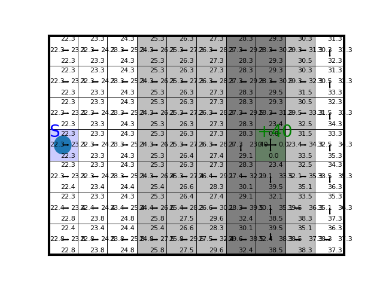

# Tabular Reinforcement Learning on Stochastic Windy Gridworld

Five value-based methods learning to cross a windy grid, compared against the
exact dynamic-programming solution. The point of the assignment is the
comparison itself: how exploration strategy, on- versus off-policy back-ups,
and back-up depth each change what an agent learns and how fast.



The figure above is the exact solution: Q-value iteration converges in **18
sweeps**, giving `V*(start) = 23.31` and an average reward of **≈1.30 per
timestep** under the greedy policy. That number is the ceiling every learning
curve in this repository is drawn against.

Course assignment (Reinforcement Learning, MSc Computer Science, Leiden
University, spring 2023).

## Assignment goal

A primer on tabular, value-based reinforcement learning: solve the MDP exactly
with dynamic programming, which assumes full access to a model of the
environment, then see how close model-free agents get from experience alone.
The comparisons that follow isolate three choices every value-based agent
makes — how it explores, whether it learns from the policy it is following or
from the greedy one, and how far ahead it looks before bootstrapping.

## The environment

A 10×7 gridworld based on Sutton & Barto's Windy Gridworld (Example 6.5), made
stochastic: the vertical wind fires only **80%** of the time, so the same action
in the same state does not always land in the same place.

| | |
| --- | --- |
| Start | `(0, 3)`, marked **S** |
| Goal | `(7, 3)`, reward **+40**, terminal |
| Every other step | reward **−1** |
| Actions | 4 — up, down, left, right |
| Wind per column | `(0,0,0,1,1,1,2,2,1,0)`, applied 80% of the time |

Because the goal pays +40 and each step costs −1, the average reward per
timestep is positive only once an agent reaches the goal reliably and quickly.
An agent that never finds it sits flat at −1.0.

## Methods

| File | Method | Back-up |
| --- | --- | --- |
| `DynamicProgramming.py` | Q-value iteration | full model sweep over `p(s'\|s,a)` |
| `Q_learning.py` | Q-learning | 1-step, off-policy (`max` over next actions) |
| `SARSA.py` | SARSA | 1-step, on-policy (the action actually taken) |
| `Nstep.py` | n-step Q-learning | n-step return, then bootstrap |
| `MonteCarlo.py` | Monte Carlo | full episode return, no bootstrap |

Every learning agent supports two exploration strategies: **ε-greedy** and
**softmax** (Boltzmann) over the Q-values.

## Setup

```bash
python -m venv .venv && source .venv/bin/activate
pip install -r requirements.txt
```

## Usage

**The exact solution**, and the DP optimum the other plots reference:

```bash
python DynamicProgramming.py                     # prints V*(start) and mean reward/step
python DynamicProgramming.py --repetitions 50    # average the greedy rollout over 50 episodes
python DynamicProgramming.py --save-figures      # write step_0.png, step_8.png, step_18.png
python DynamicProgramming.py --render            # watch the value estimates converge
```

**The experiments**, one per figure in the report:

```bash
python Experiment.py exploration      # e-greedy vs softmax        -> exploration.png
python Experiment.py on-off-policy    # Q-learning vs SARSA        -> on_off_policy.png
python Experiment.py depth            # n-step vs Monte Carlo      -> depth.png
python Experiment.py all
```

Each setting averages **50 repetitions of 50,000 timesteps**, so a full figure
takes a long time. To sanity-check one quickly:

```bash
python Experiment.py depth --repetitions 2
```

Individual methods can also be run on their own — each file has a `test()`
entry point that prints the mean reward per timestep:

```bash
python Q_learning.py
```

## Results

| Figure | What it shows |
| --- | --- |
| `step_0.png`, `step_8.png`, `step_18.png` | Q-value iteration at sweep 0, 8 and convergence |
| `exploration.png` | ε-greedy (ε = 0.02, 0.1, 0.3) vs softmax (τ = 0.01, 0.1, 1.0) |
| `on_off_policy.png` | Q-learning vs SARSA at α = 0.02, 0.1, 0.4 |
| `depth.png` | 1-, 3-, 10-, 30-step Q-learning vs Monte Carlo |

Reading `depth.png`: shallow back-ups win here. 1-step Q-learning reaches ≈0.5
reward per timestep, 3-step is faster to climb but much less stable, and deeper
back-ups do progressively worse. Monte Carlo never leaves −1.0 within 50,000
timesteps — with 150-step episode caps on a task where only the final step pays
out, the full-episode return is too high-variance to learn from.

`depth_1.png` is an earlier run of the same experiment, kept for reference. It
disagrees with `depth.png` about 1-step Q-learning (flat at −1.0 there), so
`depth.png` is the figure consistent with the code as it now stands.

## Repository layout

| Path | |
| --- | --- |
| `DynamicProgramming.py` | Q-value iteration and the DP optimum |
| `Q_learning.py`, `SARSA.py`, `Nstep.py`, `MonteCarlo.py` | the four learning agents |
| `Experiment.py` | experiment driver, one subcommand per figure |
| `Environment.py` | the gridworld — **course-provided**, unmodified |
| `Helper.py` | plotting, smoothing, softmax, tie-breaking argmax — **course-provided** |
| `*.png` | figures |

The four agent files started as course skeletons: the class scaffolding,
signatures and docstrings are Thomas Moerland's, and the algorithm bodies
(`select_action`, `update`, and the training loops) are ours.

## Known issues

Found while cleaning the repository up. These are documented rather than
changed, so the committed figures stay reproducible from the code as it stands.

1. **SARSA does not re-select its action after an episode ends.**
   In `sarsa()`, `done` triggers `s = env.reset()` but leaves `a` holding the
   action chosen for the *terminal* state. The next iteration steps the fresh
   start state with that stale action. SARSA should draw a new action for the
   new state.
2. **Monte Carlo never updates the first step of an episode.**
   The return loop in `MonteCarloAgent.update` runs `range(T_ep - 1, 0, -1)`,
   which stops at `t = 1`. The first state-action pair of every episode is
   skipped. Fixing it made no difference beyond noise in a single-seed check
   (−0.9986 vs −1.0000 over 30,000 steps), consistent with the flat Monte Carlo
   curve in `depth.png`.
3. **`SARSA.py` and `Nstep.py` use `np.argmax`, not `Helper.argmax`.**
   `Helper.argmax` exists specifically to break ties at random. Plain
   `np.argmax` always returns the lowest index, so while `Q_sa` is still all
   zeros the greedy branch picks action 0 every time. `Q_learning.py` and
   `MonteCarlo.py` use the tie-breaking version — the inconsistency is the bug.
   It is not what limits these agents, though: swapping it in changed n-step
   from −0.571 to −0.630 on a single seed, i.e. within noise.
4. **No seeding.** The environment's wind and every exploration draw use the
   global NumPy RNG, so no run is exactly reproducible. Results are averaged
   over repetitions instead.

Two things *were* fixed, because they provably change nothing: Q-learning,
SARSA and n-step all bootstrapped through terminal states, and `SARSA.update`
opened with an unfinished `if done: pass`. Terminal `Q_sa` rows are never
updated and so stay zero, which makes the bootstrap term exactly 0 either way —
verified as bit-identical reward sequences over 8,000 seeded timesteps.

## Credits

Group work by **Nikolaos-Maximos Bilalis** and **Christos Tsirogiannis**.

`Environment.py`, `Helper.py` and the skeletons of the four agent files are
teaching material by **Thomas Moerland** (Leiden University), included
unmodified except where noted. The assignment brief itself is deliberately not
redistributed here. The gridworld extends Example 6.5 of
[Sutton & Barto](http://incompleteideas.net/book/RLbook2020.pdf).
